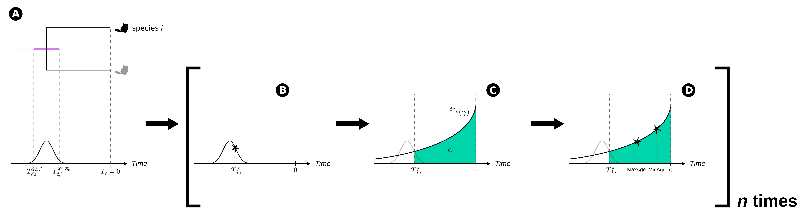
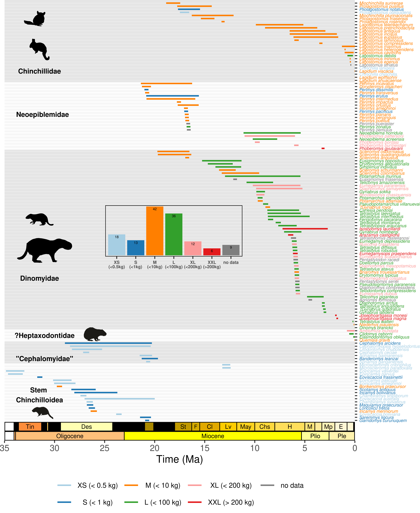
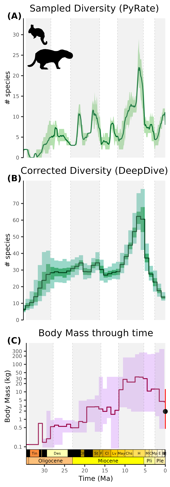
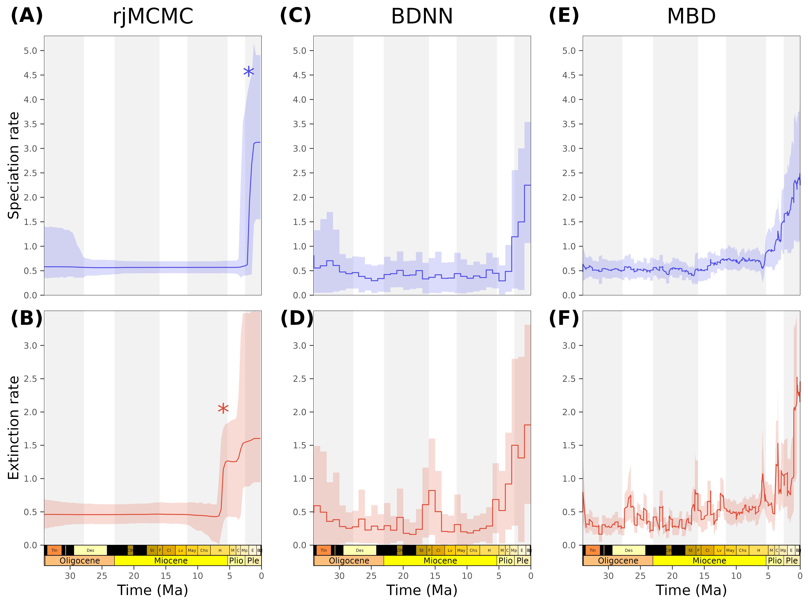

¹ Institut des Sciences de l’Evolution de Montpellier, Université de Montpellier, CNRS, IRD, Place Eugène Bataillon, 34095 Montpellier cedex 5, France.

² Instituto de Ecorregiones Andinas (INECOA), Universidad Nacional de Jujuy, CONICET, IdGyM, Avenida Bolivia 1661, 4600 San Salvador de Jujuy, Jujuy, Argentina.

\* corresponding authors: lucas.l.buffan\@gmail.com, mboivin\@idgym.unju.edu.ar

**Keywords:** Environment-dependent Diversification; Fossil Record; Gigantism; Macroevolution; South America; Trait-dependent Diversification

# Abstract

# Introduction

How taxonomic diversity and morphological disparity vary and covary through evolutionary timescales has long puzzled evolutionary biologists [@simpson1944]. Evolution towards gigantism has been repeatedly documented in the fossil record of a wide array of animal clades [*e*.*g*., @sander2011; @bianucci2023], raising the two-sided question of what drove the emergence and the subsequent demise of these remarkable phenotypes [@pimiento2019; @chiarenza2020; @boessenecker2019; @boscaini2025]. Two classes of factors are usually invoked to explain the long-term dynamics of biological diversity. On one side, the classical 'Red Queen' hypothesis [@vanvalen1973] posits that evolutionary changes primarily result from biotic interactions, such as inter-clade competition [*e*.*g*., @silvestro2015; @drury2016]. On the other hand, a wealth of hypotheses summarised under the 'Court Jester' model [@barnosky2001] rather places the emphasis on abiotic factors as a primary driver of evolutionary changes [*e*.*g*., @stenseth_coevolution_1984; @vrba1993; @vrba1995]. Deciphering how these factors shape speciation and extinction dynamics as well as the evolution of phenotypes is a central aim of macroevolutionary research [*e*.*g*., @benton2009; @quental2013; @condamine2018], and may in turn provide answers to the evolutionary questions raised by gigantism.

During most of the Cenozoic, the isolation of South America constrained the landmass' mammalian fauna to evolve in a vacuum, leading to a vast array of endemic radiations [*e*.*g*., @simpson1980]. Among the most emblematic are the impressively disparate New World hystricognath rodents (Hystricognathi: Caviomorpha), accounting for *c.* 10% of the global extant rodent diversity [@database]. The astonishing disparity within Caviomorpha is greatly exemplified by their body size range, going far beyond what is usually found in the Rodentia, from 50--80 g (*Tympanoctomys kirchnerorum* Teta, 2014) to 50 kg (*Hydrochoerus hydrochaeris* Linnaeus, 1766, the largest living rodent) [@patton2015]. In fact, hystricognaths, and particularly caviomorphs, evolved the largest body sizes found in the Rodentia. Moreover, interestingly, evolution towards large (*i*.*e*., body mass above 10 kg) to giant (*i*.*e*., above 100 kg) body sizes occurred iteratively and independently in an almost coordinated way among distinct caviomorph lineages [*e*.*g*., @vucetich2015; @álvarez2017], a trend particularly well illustrated within the Chinchilloidea.

Today, Chinchilloidea includes eight medium-to-large-sized species with high-crowned, ever-growing (euhypsodont) cheek teeth, distributed among four distantly-related genera -- *Chinchilla* Bennett, 1829, *Lagidium* Meyen, 1933 and *Lagostomus* Brookes, 1828, forming the family Chinchillidae, and *Dinomys* Peters, 1873, the only living representative of the Dinomyidae. The fossil record of Chinchilloidea extends back to the latest Eocene [@antoine2021] and comprises more than 100 described species with variable degrees of crown height [*i*.*e*., hypsodonty; *e*.*g*., @candela2005], including many of the largest rodents ever recorded. On the South American landmass, fossils of giant chinchilloids were assigned to $\dagger$Neoepiblemidae (*e*.*g*., $\dagger$*Phoberomys* Kraglievitch, 1926) and Dinomyidae (*e*.*g*., $\dagger$*Isostylomys* Kraglievich, 1926 or $\dagger$*Josephoartigasia* Mones 2007, the latter being the largest rodent ever recorded) [*e*.*g*., @sánchez-villagra2003; @rinderknecht2008; @rasia2024]. All these giant taxa, together with the rest of the Chinchilloidea, flourished until the Mio-Pliocene and further vanished, leaving the modest extant diversity of the group (achieving no more than some 15kg for *Dinomys branickii*, the largest extant chinchilloid, an order of magnitude below its giant ancestors) as a relic of a formerly speciose superfamily [@vucetich2015; @marivaux_early_2020; @rasia_comprehensive_2021]. In addition, systematics based on morphological characters (primarily dental traits) also placed the Pleistocene Caribbean 'giant hutias' $\dagger$*Amblyrhiza inundata* Cope, 1868 and $\dagger$*Elasmodontomys obliquus* Anthony, 1916 within Chinchilloidea[^1]. Therefore, over their evolutionary history, chinchilloids have experienced a simultaneous increase and further decline in both disparity and diversity [@carrillo].

[^1]: One might however mention that, as summarised by @marivaux2022, the phylogenetic placement of $\dagger$*Elasmodontomys* still represents a real *conundrum*, with contrasting sources of evidence either suggesting this taxon to be nested within Chinchilloidea [*e*.*g*., @marivaux_early_2020; @marivaux2022], Octodontoidea [*e*.*g*., @woods2021] -- another caviomorph superfamily -- or to be a morphological intermediate between those two clades (*i*.*e*., Octochinchilloi, sensu @boivin2019) [@macphee2011; @dacunha2023].

Several hypotheses have been advocated to explain chinchilloid's diversity dynamics and exceptional phenotypical evolution. @vucetich2015 proposed gigantism among caviomorphs to have been promoted by the late Neogene climate cooling and aridification [@westerhold2020], thought to have expanded open habitats in continental South America [@palazzesi2012]. Such climate-induced landscape opening has also traditionally been invoked to explain caviomorphs' -- together with native ungulates' -- increase in hypsodonty [@macfadden2000]. Nevertheless, it should be mentioned that several evidence challenged the relationship between grass consumption and hypsodonty [*e*.*g*., @billet2009; @damuth2011; @strömberg2013; @armella2026]. Other authors proposed that the river network remodelling that followed the demise of the north Argentinian Miocene marine transgression ['Paranense Sea', *see* @pascual1996], locally generating environmental heterogeneity, favoured the ecological diversification of dinomyid rodents [@candela2013]. In the same time frame, a marine incursion analogous to the 'Paranense Sea', the 'Pebas megawetland system' (PMWS), covered Western Amazonia. Its Late Miocene vanishing triggered massive hydrographic changes, among which the establishment of the Amazon drainage system, in turn massively impacting low-latitude ecosystems in South America [*e*.*g*., @jaramillo2017; @hoorn2022]. Thus, one can expect the legacy of the PMWS to have also impacted the radiation of Chinchilloidea, the latter peaking as these hydrographic changes occurred. These two marine transgressions were shown to be tectonically- and eustatically-controlled [@hernández2005]. Thus, one can also expect to retrieve a signal of the Andean uplift, as well as from sea-level changes, in the dynamics of chinchilloid diversification. In addition, on the basis of results established on modern species showing similar phenotypic pathways, patterns of size increase among caviomorphs were also proposed to be related to biotic factors, such as intra- or interspecific competition, predator avoidance or physiological constraints (*e*.*g*., metabolic rate) [@vucetich2015]. @álvarez2017 added that the environmentally-driven emergence of new niches and their further colonisation by caviomorphs must have promoted size increase in this rodent clade. Regarding the West Indian 'giant hutias', instead of environmental drivers, the 'island rule' [@van_valen_pattern_1973; @damuth1993; @lomolino2005; @faurby2016; *but see* @meiri2007] has been proposed to explain their spectacular increase in size -- particularly in the case of $\dagger$*Amblyrhiza* [*e*.*g*., @biknevicius1993; @mcfarlane1998].

Besides, questions are also raised by chinchilloid taxonomic and morphological diversity decline. Indeed, the group was diverse in the Late Miocene (Chasicoan--Huayquerian South American Land Mammal Ages \[SALMAs\]), with at least 20 co-occurring species on the continent [@candela2005], including most of its largest representatives [*e*.*g*., @carrillo_giant_2015; @rasia_reappraisal_2018; @rasia2024]. Then, the group experienced a massive decline, wiping out the entire $\dagger$Neoepiblemidae and virtually all representatives of the Dinomyidae. Notably, all large-to-giant forms were concomitantly erased. Nevertheless, despite the apparent size selectivity of the aforementioned decline, the latter does not apply to other traits like hypsodonty. Pliocene cooling and desertification was proposed as a driver underlying the demise of the clade in Southern South America [@vucetich2015]. Moreover, given that the time frame of the demise of the Chinchilloidea matches the Great American Biotic Interchange [@marshall1982; @webb1985], one can also wonder whether such a demise can be related to the arrival of North American migrants, either competing for similar food resources (*e*.*g*., horses, elephants) or preying on native species (*e*.*g*., carnivorans).

Despite all this, major gaps remain in our understanding of the evolutionary dynamics of Chinchilloidea. In particular, many of the hypotheses raised above have poorly considered the interplay between phenotypic and biological diversification. Previous works relying on a phylogenetic framework illustrated that the dynamics of chinchilloid diversity and body mass evolution were decoupled [@álvarez2017; @carrillo]. However, many extinct taxa lack DNA or sufficient morphological material to be accurately replaced in a phylogenetic framework, leading to their exclusion from subsequent macroevolutionary analyses relying on phylogenies. Thus, there is much to gain by relaxing phylogenetic assumptions and fully taking advantage of the rich fossil record of the group to reconstruct its macroevolutionary history. In addition, the factors that underpinned the clade diversification remain elusive despite the major palaeoenvironmental upheavals that took place in South America since the late Eocene (e.g., Andean orogeny, marine introgressions, river network changes, onset of the dry diagonal).

Here, we investigate the evolutionary history of Chinchilloidea and highlight its environmental correlates, with an emphasis on phenotypic evolution. To do so, we compiled and revised 708 chinchilloid fossil occurrences from the literature and used divergence times leading to extant species absent from the fossil record extracted from a dated phylogeny to build the most exhaustive temporal occurrence database ever produced for this group, encompassing 62 genera and 129 species. In parallel, we collected dental traits and measurements in order to carry out body mass reconstructions based on recently-published sets of predictive equations, and reconstructed hyposodonty indices based on crown heights of cheek teeth. We further analysed chinchilloid diversity and diversification dynamics throughout their entire evolutionary history using state-of-the-art preservation-aware methodological frameworks, and sought for their likely environmental drivers, allowing rate variations across time, body size and crown height categories. We hypothesise that (i) climate -- in particular temperature -- evolution since the middle Miocene impacted the diversification history of Chinchilloidea; (ii) continent-scale changes in habitat connectivity, either mediated by hydrographic (*i*.*e*., sea level) or tectonic (*i*.*e*., Andean elevation) factors had repercussions on the macroevolutionary fate of Chinchilloidea; (iii) the magnitude of the changes in speciation and/or extinction rates were heterogeneous across body size and hypsodonty categories.

# Materials and Methods

## Temporal occurrence database

We downloaded genus- and species-level fossil occurrences of Chinchilloidea from The Paleobiology Database (https://paleobiodb.org). Each entry was then checked and, if necessary, updated by us (taxonomic name, fossiliferous locality and geologic formation, age range). We tried to give the most precise age range on the basis of the data available in the literature, firstly searching limits for the fossiliferous level(s), then increasing to the member, formation or locality level in case the first did not exist. We updated some ages previously published given recent chronostratigraphic (International Chronostratigraphic Chart 2024/12; @cohen2025) and geomagnetic [@ogg2020] scales. The SALMA limits are based on @dunn2013, @brandoni2016, @fernicola2019, @cuitiño2021 and @muñoz2023. This compilation was further complemented by an extensive literature review which enabled the removal of duplicates and the incorporation of missing published data. We excluded occurrences with open nomenclature names (cf., aff., ?) from upstream analyses.

We developed a simple approach relying on an exhaustive dated phylogeny extracted from VertLife (*add more info*) to incorporate extant species lacking fossil record (*i*.*e*., *Chinchilla chinchilla*[^2], *Chinchilla lanigera*, *Lagidium ahuacaense*, *Lagidium viscacia*[^3], *Lagidium wolffsohni* and *Dinomys branickii*) in our database (@fig-ExtSampl). Such an incorporation avoided the artificial speciation rate inflation towards the present that we obtained when constraining ourselves to assign an occurrence of modern age (*i*.*e*., `min_age` = `max_age` = 0 Ma) to each of these taxa. Combining information from the fossil record and molecular phylogenies for macroevolutionary inference was already done for groups where a large proportion of the extant diversity is absent from the fossil record, like the elasmobranchs [@brée2022; @marion_bioluminescence_2025]. These studies typically considered the divergence times leading to extant species (hereafter termed $T_{d,i}$ for a given species $i$) as a proxy of extant species' times of origination ($T_{s,i}$), and carried out their macroevolutionary inference out of a single combined origination and extinction times dataset − acknowledging that extant species' times of extinction were by definition equal to zero. Here, we propose to treat $T_{d,i}$ as a lower bound of $T_{s,i}$. Our approach therefore involves sampling virtual occurrences of each extant species $i$ within $[0, T_{d,i}]$, and incorporating these virtual occurrences into the previously-introduced fossil occurrence database. Assuming sampling probability to decrease as we get closer to $T_{d,i}$ [@liow2010], we therefore randomly drew $n$ occurrences of the species $i$ from a truncated exponential distribution ($^{tr}\epsilon$) of rate $\gamma$ determined so that an arbitrary proportion $\alpha$ of the non-truncated distribution lies within $[0, T_{d,i}]$ (@fig-ExtSampl). This leads to

[^2]: Remains of *Chinchilla chinchilla* were in fact once reported from an archaeological assemblage, but we assume their age to be too close to the present to provide useful information on the time of speciation of the species.

[^3]: Same as for *Chinchilla chinchilla* remains.

$$\gamma = \frac{-ln(1-\alpha)}{T_{d,i}}$$

In practise, we sampled $n=10$ values $T_{d,i}^{\star}$ from the 95% HPD of $T_{d,i}$ (Table S2). Since we did not have direct access to the distribution in itself but rather to its lower and upper bounds (respectively $T_{d,i}^{2.5\%}$ and $T_{d,i}^{97.5\%}$), we approximated it to a normal distribution of mean $\mu = \frac{T_{d,i}^{97.5\%} + T_{d,i}^{2.5\%}}{2}$ and variance $\sigma^2 = \frac{T_{d,i}^{97.5\%}-\mu}{1.96}$. Then, for each of the 10 $T_{d,i}^{\star}$ values, we sampled the minimum and maximum ages of a virtual occurrence from $^{tr}\epsilon(\gamma)$ by setting $\alpha=0.95$, except for *Dinomys branickii*. Indeed, given that the divergence time of *D. branickii* with the rest of the extant representatives of the clade ($T_{d, branickii}$) is too ancient to be reasonably considered as an approximation of the time when the species originated (HPD 95% = $[16.5, 24.8]$ Ma), we set $\alpha=0.999$. By doing so, we made it almost impossible to sample an occurrence maximum age close to $T_{d, branickii}$.

All this resulted in one species-level database (540 occurrences, 129 species, including 65 singletons) and one genus-level database (771 occurrences, 62 genera, including 19 singletons), spanning the entire lifespan of the clade (from the latest Eocene to present).

On the basis of their sampling location, occurrences were binned into three spatial domains: Tropical, Extratropical and Caribbean. This spatial binning was conducted to guide the simulation step of DeepDive -- see next sections. Due to the substantially fragmented nature of the West Indian fossil record, the latter domain -- only encompassing five species, *Borikenomys praecursor*, *Amblyrhiza inundata*, *Elasmodontomys obliquus*, *Clidomys osborni* and *Quemisia gravis* -- was very structured in time, only covering the Quaternary, with the notable exception of a single late early Oligocene occurrence (*B*. *praecursor*). Analyses with and without these taxa were thus conducted.

## Trait data collection

On the basis of body mass reconstructions carried out from cranial and dental proxies detailed in @boivin2024, complemented with a literature review, species were classified in six body size categories: XS ($<$ 0.5kg), S (0.5--1kg), M (1--10kg), L (10--100kg), XL (100--200kg) and XXL ($>$ 200kg).

We scored the tooth growth types of the upper molars mainly based on the hypsodonty index (HI), which corresponds to the crown height of a maximum unworn tooth / its anteroposterior length or labiolingual width [@vanvalen1960; @janis1988; Supp. XXX]. We recognized four categories: brachydont (HI $<$ 0.9, rooted), mesodont (0.9 $<$ HI $<$ 1.1, rooted), protohypsodont (HI $>$ 1.1, rooted), and euhypsodont [HI $>$ 1.1, unrooted; @mones1982; @pérez_new_2010]. The category scoring is derived from literature sources, observations and unpublished measurements made by the authors.

## Palaeodiversity and diversification inference from the fossil record

Our occurrence database was first analysed using PyRate v3.1.3 [@silvestro2014; @silvestro2019]. Genus origination and extinction times (altogether forming the palaeodiversity) and the underlying diversification process (*i*.*e*., origination and extinction rates) were jointly estimated in a Bayesian framework accounting for preservation heterogeneity, and approximated through Reversible-Jump Markov Chain Monte Carlo (RJMCMC). We ran the RJMCMC algorithm for 10 million iterations, sampling every 10,000. We used a time-dependent preservation process allowing for preservation rate shift between geological stages (Figure S2). We allowed preservation rates to vary between lineages according to a *Gamma* model. These analyses were replicated 20 times after randomly sampling fossil ages between each occurrence's upper and lower age boundaries. MCMC runs that achieved convergence, *i*,*e*., with Effective Sample Size (ESS) over 200 ($n=20$, Figure S3) were further combined. To evaluate the robustness of our analyses, we conducted sensitivity analyses by either removing singletons from the input occurrence database or subsampling to unique locality-lineage combinations, as done in @buffan2025 (**Supp. Fig. XX** and **YY**). Parameter convergence was monitored using the pymc 5.9.2 python library, and we considered parameters achieved convergence following the same criterion as before ($ESS > 200$).

In order to obtain an alternative perspective on the temporal patterns of SAM diversity accounting for the incompleteness of the fossil record differently (*i*.*e*., without explicitly modelling it), we used the recently-developed fossil-based palaoediversity reconstruction framework implemented in DeepDive v1.0.28 [@cooper2024]. DeepDive uses a spatially-explicit biodiversity simulator coupled with a fossilisation process to simulate fossil occurrences under a wide range of scenarios. Simulation parameters (*e*.*g*., sample size, number of regions, ...) can be user-tuned so simulated scenarios reflect more any empirical case study. Then, a deep-learning model relying on recursive neural networks is trained to predict palaeodiversity from a set of features directly extracted from the simulated occurrence datasets (*e*.*g*., number of singletons, range-through diversity, ...), within a user-defined set of time bins. We are therefore in a case of supervised learning. Once the model achieves a satisfying training level (quantified with a loss function, see Table S1), the same features are extracted from the empirical set of fossil occurrences and fed into the trained neural network to get an estimate of palaeodiversity through time.

In practice, we ran DeepDive from configuration files produced with the R package DeepDiveR v1.0 [@cooper2025]. Below, we provide an overview of our motivations behind some parameter values. Exhaustive details of the values we set for each parameter are available in the configuration files (see *Supplementary Data*).

*Simulation.* We generated 150,000 training and 1000 test sets. For each simulated dataset, the number of starting lineages was set between 30 and 150, and we chose to set the number of regions where our taxa occurred to two, reflecting our empirical dichotomy between tropical and extratropical biomes. We set the number of extant taxa in the simulations -- as well as in the predictions -- to 340, reflecting the order of magnitude of the number of South American mammal genera [@burgin2025].

*Model training.* Following @cooper2024, we tested models with variable numbers of bidirectional 'Long Short-Term Memory' (LSTM) layers, including or not additional fully-connected 'dense' layers, and selected the best architectures based on the mean squared error (MSE) between simulated (*i*.*e*., 'true') and predicted diversity of each set of fossil occurrences of our training set (`Evaluation loss`). Our retained network architecture comprised two LSTM layers (64 and 32 nodes) coupled with one dense layer (32 nodes) (Figure SX-Y and Table S1).

*Empirical predictions.* We made 100 replicates of age assignment for occurrences in our fossil database.

## Drivers behind macroevolutionary patterns

### Environmental variable selection

To make sense of the macroevolutionary patterns that we reconstructed in terms of environmental process, we incorporated two regional and one global abiotic variables in our workflow. First, as illustrated by many studies, the Andean uplift has often been identified as a key driver for the build-up of South American ecosystems from the Neogene to the present [@hoorn1995; @antonelli2009; @hoorn2010; @tarquini2022; @vallejos-garrido2023; @solórzano2024]. Thus, we incorporated the multi-proxy reconstruction of the pace of the Andean uplift produced by [@boschman2021] -- averaged across the entire continent or more spatially refined. Another abiotic factor frequently retrieved as significantly influencing diversification in a wide array of clades is temperature [*e*.*g*., @condamine2018; @condamine2019; @flannery-sutherland2022; @weppe2023]. So far, studies testing the effect of palaeotemperature on clade diversification have often used global proxy-derived temperature reconstructions [*e*.*g*., @westerhold2020]. The main limitation of this approach is that it poorly reflects regional climatic idiosyncrasies. We therefore used the regional South American average temperature reconstructions recently produced by @tardif2025. Also, South America biomes have been highly influenced by hydrographic reorganisations, tightly related to the Andean orogeny, but also to eustatism [@hoorn2022; @guayasamin2024]. We therefore incorporated the sea level reconstructions of @miller2020 in our analyses. Last, diversity-dependent effects have been illustrated many times as important drivers for changes in macroevolutionary rates [@etienne2011; @condamine2019; @condamine2020] in a wide range of clades. Therefore, we allowed for diversity-dependence in our environment-dependent diversification (EDD) analyses.

### Multivariate Birth-Death (MBD) analyses

At first, we carried out EDD analyses using the Multivariate Birth-Death (MBD) model implemented in PyRate [@lehtonen2017]. Given origination and extinction times inferred by PyRate (see previous part), the MBD model *de novo* estimates origination and extinction rates (resp. $\lambda$ and $\mu$) using a birth-death process where $\lambda$ and $\mu$ are functions of environmental variables. Given a set of environmental correlates of size $n$ (in our case, $n=4$), the model assumes either a linear or an exponential dependency between $\lambda$ (or $\mu$) and the environment correlates -- here, we only tested for exponential dependencies. Therefore, to a given rate, $n$ correlation parameters -- one per environment variable -- are estimated (resp. $G_{\lambda,i}$ or $G_{\mu,i}$), plus a baseline rate. Each $G_{\lambda,i}$ or $G_{\mu,i}$ is assigned a shrinkage weight (resp. $w_{\lambda,i}$ and $w_{\mu,i}$), ranging from 0 to 1, testing for the strength of the relationship between the newly-estimated rate and each environmental variable individually. A correlation coefficient $G_{.,i}$ is considered significant if $median(w_{.,i})>0.5$ and if its 95% Highest Posterior Density interval (HPD) does not overlap with 0. An MCMC algorithm jointly approximates the posterior distribution of each $G_{.,i}$ and their associated $w_{.,i}$ while controlling for over-parameterisation. We scaled environmental predictors prior their incorporation to the model, and ran each set of MBD analyses across 10 million iterations, with a sampling frequency of 10,000.

### Birth-Death Neural Networks (BDNN) analyses

We consolidated our EDD analyses by using the BDNN model [@hauffe2024]. BDNN uses PyRate's framework to estimate preservation-aware times of origination and extinction for each taxon of the occurrence database. Given these times, it further extends the birth-death process used in PyRate to model origination and extinction rate dynamics by allowing rates to vary not only across time, but also across lineages. One of the key advances of BDNN is that it uses an unsupervised neural network to estimate these rates as a function of a user-provided set of external predictors, such as environmental covariates or biological traits. It therefore does not assume any predefined dependency between diversification rates and the variables tested -- contrary to the linear vs. exponential dichotomy usually offered by model-based EDD. Consequently, these dependencies can be complex, going beyond linearity, and can change through time. The so-estimated rates are then directly incorporated in the likelihood function of the birth-death process implemented in PyRate. Noteworthy, BDNN provides the ability to test for the combined effect (*i*.*e*., interaction) of multiple variables, and further ranks the predictors according to their respective contribution to the modelled macroevolutionary pattern by using common explainable AI metrics [for additional details, see @hauffe2024].

All model parameters were estimated using an MCMC algorithm that we ran for 50 million generations, sampling every 50,000. As in our PyRate analyses, we used a time-dependent preservation process allowing preservation rate shift between geological stages, and between lineages according to a *Gamma* model. Predictors (*i*.*e*., environmental covariates and categorical traits) were scaled prior to their incorporation in the model. As recommended by @hauffe2024, we tested several network architectures (2 layers with 16 and 8 nodes; 3 layers with 32, 16, 8 nodes). These two alternative architectures did not differ in their outcome (**Fig. SX**, **Tab. SX**); all the BDNN results presented thereafter were obtained with the default network architecture (2 layers with 16 and 8 nodes). As BDNN cannot handle missing data, we excluded species for which we could either not reconstruct body mass or hypsodonty index from this set of analysis, altogether representing 11 species[^4] and 79 occurrences.

[^4]: The species that we had to exclude are: *Agnomys formosus*, *Diaphoromys compressidens*, *Eusigmomys friasensis*, *Pentastylodon racedi*, *Pentastylomys seriei*, *Protomegamys coligatus*, *Telodontomys compressidens*, *Tetrastylomys castellanosi*, *Perimys pueraster* and *Perimys oemulus*.

### Age-Dependent Extinction (ADE) model

To investigate the potential effect of species age on their extinction probabilities, we used the ADE model [@hagen2018]. This model uses a Weibull distribution to model the relationship between species age and their probability to go extinct. The shape parameter ($\phi$) of the distribution informs about the direction of such a relationship, with $\phi<1$ indicating decreasing extinction probability decreases with species age, $\phi>1$ increasing extinction probability with species age, and $\phi=1$ no relationship between species age and extinction probability. We fitted the ADE model to our fossil occurrence database, approximating the posterior distribution of the model parameters with an MCMC algorithm that we ran across 40 million MCMC generations, sampling every 40,000. Parameter convergence was assessed using the pymc library v5.9.2 , and we considered parameters achieved convergence if their ESS was above 200.

# Results

## The waxing-and-waning diversity and body size evolution of chinchilloid rodents

Either relying on a Bayesian preservation-aware framework (PyRate) or supervised neural networks (DeepDive), our macroevolutionary modelling of the fossil record evidenced a Late Miocene increase in chinchilloid diversity followed by a sharp decline from *ca*. 6.5 Ma [@fig-diversityBM A--B]. At their maximum, median sampled and corrected diversity exhibit a 3-fold difference, respectively peaking at 22 and 62. Four additional -- though more attenuated -- peaks may be reported from the sampled diversity curve : one in the late Oligocene (Deseadan SALMA), two in the Early Miocene (Colhuehuapian and Santacrucian SALMAs) and one in the late Middle Miocene (Laventan SALMA) [@fig-diversityBM A]. These peaks are barely recovered from the corrected diversity curve, potentially excepted for the Colhuehuapian and Santacrucian ones [@fig-diversityBM B].

The reconstructed broad diversity pattern elegantly matches with the dynamics of body size evolution across the history of the clade [@fig-diversityBM]. According to our estimates, 

Positive net diversification rate until *ca*. 6 Ma, decline and increase in extinction rate (cite figures accordingly).

All DD architectures performed similarly, as long as they comprised at least one dense layer connecting the output of the LSTM layers to the output layer (**Supp. Tab. 8**).

The coefficients of rate variations obtained for BDNN (resp. XX and XX) exceeded the thresholds inferred from analyses of 100 simulated datasets generated under a constant-rate birth-death model, matching our empirical data in terms of trait number, age of the clade and (approximately) number of species (resp. XX and XX). This therefore provides evidence for significant rate variations throughout the evolutionary history of Chinchilloidea.

## A body-mass selective XXX XXX evolutionary decline

Evidence for Cope's rule

Speciation rate significantly differs across body size classes, with larger taxa achieving higher values (Fig. X and S5). According to the BDNN model, body size stands out as the first predictor explaining variations in speciation rate within Chinchilloidea, with a *ca*. 2.5-fold change obtained between our two extrema (*i*.*e*., XS and XXL =\> **indicate on the violin plot**).

In our BDNN analyses, time is always ranked as the least important predictor, suggesting our environmental and trait variable effectively capture signal of rate variation.

## Side notes

Our deep learning-based analysis of diversification provided evidence for significant origination and extinction rates variation as compared to a constant-rate birth-death model with the same amount of lineages and root ages as our empirical data (coefficients of rate variation table).

Heterogeneity in lineage-specific diversification rates (example of lineages/groups of taxa).

Also, tropical lineages appear to have overall lower origination and extinction rates, suggesting enhanced biotic turnover outside the tropics.

Diversity-dependent effects were found to be the most important factor influencing origination rate variations, with decreasing rate values with increasing diversity. Andean uplift and palaeotemperature were respectively ranked at the second and third positions on the predictor importance scale.

Palaeotemperature was retrieved as most significantly influencing extinction rate variations, via a negative relationship -- extinction rate decreases when palaeotemperature increases. Sea level and Andean uplift respectively arrived second and third. At a given palaeotemperature, extinction rate was higher when sea level was higher.

Results robust to different network architectures.

# Discussion

Unlike the evidenced decoupled diversity and disparity patterns evidenced between caviomorph superfamilies [*e*.*g*., @álvarez2017; @carrillo], our results suggest a coordinated behaviour of chinchilloid diversity and disparity, both peaking in the late Miocene and further declining towards the present.

Turning point in Dinomyid diversification at high latitudes in the Chasicoan (e.g., Arroyo Chasicó locality, La Pampa, Argentina), with the record of a great number of Euhypsodont taxa, meanwhile protohypsodont taxa became scarcer (though still recovered at lower latitudes) @rasia2024

Our results suggest a "waxing-and-waning" diversity pattern for chinchilloid rodents, peaking in the late Miocene (Chasicoan SALMA), with XX reconstructed taxa (fig pyrate) (YY corrected diversity, fig deepdive), and declining thereafter until the 7 extant species. This pattern goes in contradiction with the "stagnating" diversity since the Early Oligocene reconstructed by @carrillo, based on a total-evidence phylogeny. Such a mismatch between phylogeny and occurrence-derived patterns probably comes from the poor representativity of extinct chinchilloid lineages in the phylogenetic reconstruction (31 species) when compared to our occurrence database (13X species).

Caribbean lineages of Quaternary age (*Elasmodontomys*, *Amblyrhiza*, *Quemisia* and *Clidomys*) descend from at least one (but most likely several, see [@macphee2011; @marivaux_early_2020]) earlier colonisation events of the West Indies by ancestral lineages that could not be preserved in the fossil record [@marivaux2022].

How about an implication of the GABI in the Pliocene extinction rate increase?

## A coupled diversity-disparity dynamic in the Chinchilloidea

Whether this unique trajectory stems from intrinsic developmental capability, ecological opportunity or a combination of both remains an open question [@vucetich2015]

Seminal works highlighted that clades could experience coordinated or decoupled diversity and disparity trajectories linked to biological diversification -- *i*.*e*., speciation and extinction, the processes generating diversity [@foote1993; @foote1997]. Far from a one-fits-them-all rule, the diversity-disparity interplay was rather shown to be complex and case-dependent, with speciation and extinction either acting as opposing forces or reinforcing one another in the contraction/expansion of the morphospace through evolutionary times [@foote1993; @foote1997; @balseiro2025; @esteve2025]. Here, our clade offers an example of coupled dynamics of disparity and diversity [@fig-diversityBM].

Are we detecting mid-late Miocene pulses of diversification that lead to the differenciation of extant lineages postulated from the fossil record ? @vucetich2015

Clade with a rich fossil record that underwent a taxonomic and possibly ecological decline: parallel with proboscids [@cantalapiedra2021], hippopotamids [@boisserie2005; @boisserie_phylogeny_2005], rhinocerotids [@antoine2025] or lamniform sharks [@condamine_climate_2019].

## Drivers

Diet !! Evolution towards large to very large body sizes must have implied adaptations in terms of nutrient supply. Did they achieve this by consuming new forms of food? Could landscape opening play a role?

Come back to @vucetich2015 hypotheses regarding large size evolution

Demise of large sizes could also be viewed under the lens of hyperspecialisation, in turn restricting adaptabilities over evolutionary timescales [see @neige2026]

Our results did not provide any support for hypsodonty-dependent diversification. Contrary to the paradigm [@stebbins1974], previous findings illustrated that evolution of hypsodonty was not necessarily linked to grassland spreading in the Americas [@jardine2012; @strömberg2013]

**Cope's rule: what drives patters of size increase throughout the history of the clades?**

### Andes

Refugia, limiting extinction (MBD). Effect of increasing magnitude as the mountain chain gets higher. On the other hand, negative effect on origination (BDNN), first driver. "Museum"? Bear in mind that our fossil record is biased westwards, likely exacerbating the prominence of the role of the Andes for Neogene SAM diversification.

Also, late phases of Andean uplift resulted in major changes in hydrographic patterns in Tropical South America (Pebas -\> Acre -\> Amazon), which were shown to have been a significant trigger for extinctions (or wax-and-waning) among endemic lacustrine faunal assemblages [*e*.*g*., @salas-gismondi2015 + mollusks]. Subsequent effects on terrestrial communities?

### Sea level

Pebas @hoorn2022 + Paranaense sea @homerocamacho1967. Retrieved as second most important predictor for extinction rate variations by our BDNN analyses, likely having to do with hydrographic pattern changes.

## Body mass

We found that larger species tend to have higher speciation rates than smaller ones. This apparently counter-intuitive finding could reflect the fact that, at least among mammals, larger species usually have lower effective population sizes and in turn accumulate more deleterious mutations, in turn likely to generate diversity

Became larger as time went forward (DTT plot), by-product of the Cope's rule?

Broad trend to be large in the Miocene, parallel with sloths @boscaini2025

Do large species diversify at a different pace? @liow2008

Why did chinchilloid follow Cope's rule whereas octodontoids did not?

## Limitations and perspectives

### Taxonomic uncertainties

In the framework of Chinchilloidea, taxonomic uncertainties regarding key taxa (or faunas) surely hampers our appreciation of their evolutionary history.

'Mesopotamiense' fauna [@candela2005; @candela2013-] is mostly made of singletons. Large endemism, as discussed by @candela2013, but our extinction rate inflation pattern greatly relies on it (**Fig. SX**)

Lack of phylogenetic framework, hence ignoring phylogenetic relatedness, though proven relevant in previous analyses as we cannot exclude that the relationship that we find between traits (here body size) and diversification rates to be an artefact of phylogenetic inertia [*e*.*g*., @hauffe2024]. Phylogeny unresolved for key nodes though [*e*.*g*., @boivin2019; @marivaux_early_2020; @rasia_comprehensive_2021, **work in progress**].

Phylogenetic framework:

-   Test for the direct effet of intraspecific interaction in the rate of body mass evolution [@drury2016; chabrol inch'bouddah]
-   Assess whether larger (or larger-crowned) species have different pace of diversification (SSE model)

### Size-increase pattern

On the other hand, the trend towards general size increase could also come from a sampling artifact, where larger taxa are easier to spot and sample in the end, whereas sampling smaller taxa is usually more resource-demanding, involves screenwashing, which is not always possible to carry out easily based on the sampling area (*e*.*g*., proximity with a river).

Challenge to infer body sizes of extinct taxa with little extant representatives =\> Estimates can vary significantly based on the proxy or the modelling system used [@boivin2024; @paiva2026].

Being large implies additional energetic requirements =\> diet. Need for additional studies to quantify diet shifts in large forms using quantitative methods like microwear texture analysis [*e*.*g*., @robinet2020; @hullot2025].

# Conclusions

# Acknowledgements

Torsten Hauffe for his advice regarding the use of BDNN. Rebecca B. Cooper and Bethany J. Allen for their willingness to help with the use of DeepDive and DeepDiveR. L.B. was funded by a grant offered by the École Normale Supérieure de Lyon.



# References

::: {#refs}
:::



# Figures

```{r, echo=FALSE}
#| label: fig-ExtSampl
#| fig-cap: Visual representation of the occurrence sampling scheme that we implemented for extant species lacking fossil record. We approximated the posterior distribution of the divergence times leading to a given extant species $i$ (denoted $T_{d,i}$) with a gaussian of mean and variance determined by the lower and upper boundaries of the empirical 95% HPD of $T_{d,i}$ (resp. $T_{d,i}^{2.5\%}$ and $T_{d,i}^{97.5\%}$) (**A**). Then, we randomly drew a value $T_{d,i}^{\star}$ from this distribution, serving as a lower boundary for the species' origination time (**B**). We then drew simulated occurrence's minimum and maximum ages (resp. 'MinAge' and 'MaxAge') from a truncated exponential distribution ($^{tr}\epsilon$) of rate $\gamma$ determined so that a proportion $\alpha$ of the non-truncated distribution lies between $0$ and $T_{d,i}^{\star}$ (**C--D**). Steps **B--D** were repeated $n$ times, so we finally ended up with $n$ simulated occurrences per extant species lacking fossil record. In practise, we set $n=10$ and $\alpha=0.95$, except for *Dinomys branickii*, for which we set $\alpha=0.999$. *Chinchilla chinchilla* silhouette is from [Phylopic](https://www.phylopic.org/), see Tab. S3 for additional information.


```

| 
| 

```{r, echo=FALSE}
#| label: fig-lifespans
#| out-height: 19cm
#| out-width: 15cm
#| fig-cap: Bayesian reconstruction of the longevities of the 129 chinchilloid species considered in our dataset. Each segment depicts the longevity of a given species, that is, the interval between species' speciation and extinction times averaged across PyRate runs that achieved convergence. Lines, ticks and taxonomic names were coloured according to the body mass category to which species were assigned. The histogram at the centre of the plot shows the number of species within each body mass class. The first four silhouettes (from top to bottom) are from Phylopic (credits available in Table S2). The last two silhouettes (*Elasmodontomys obliquus* and *Borikenomys praecursor*) were designed by L.M. for a previous work [@marivaux_early_2020].


```

| 
| 

```{r, echo=FALSE}
#| label: fig-diversityBM
#| out-height: 20cm
#| out-width: 7cm
#| fig-cap: The joint diversity and clade-wise body size dynamics of Chinchilloidea. Occurrence-based diversity reconstructions were either produced in a bayesian preservation-aware framework jointly assessing the times of speciation and extinction of each species [@fig-lifespans] from the temporal occurrence database (PyRate) (*i*.*e*., sampled diversity, **A**), or using a simulation-based deep-learning framework incorporating a wide variety of biases to reconstruct the temporal variations of the 'true' (*i*.*e*., corrected) diversity in 1-Myr time bins (DeepDive) **(B)**. Body mass through time reconstructions (**C**, log scale) were produced after binning our body mass estimates of each species in 1-Myr time bins. The body mass of a taxon was included within a given bin if its reconstructed lifepan overlapped with it. The black dot at the right of the plot shows the median body mass of the extant chinchilloids, and the red line shows its range. In all cases, full lines represent median estimates and the lightest ribbon either shows their associated 95% HPD interval **(A** and **B)** or the total range of values **(C)**. In **(B)**, the darker ribbon depicts the interval encompassing 50% of the per-bin diversity distribution across the 100 DeepDive replicates. *Lagidium peruanum* and *Josephoartigasia monesi* silhouettes are from Phylopic (credits available in Tab. S2).


```

| 
| 

```{r, echo=FALSE}
#| label: fig-diversification
#| out-height: 11cm
#| out-width: 15cm
#| fig-cap: Comparative chinchilloid speciation and extinction rates reconstructed using three Bayesian occurrence-based birth-death models. Speciation and extinction rates are respectively depicted in blue and red. The left column **(A-B)** shows the rates estimated by PyRate, using the rjMCMC algorithm [@silvestro2019]. Stars indicate significant rate shifts.


```
